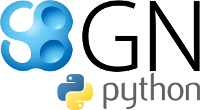

  
[](https://travis-ci.org/matthiaskoenig/libsbgn-python)
[](http://opensource.org/licenses/LGPL-3.0)
[](https://doi.org/10.5281/zenodo.192356)
[](https://coveralls.io/github/matthiaskoenig/libsbgn-python?branch=develop)
# libsbgnpy : Python bindings for SBGN

Python bindings for [SBGN](http://sbgn.github.io/sbgn/) based on the XML schema generated with [generateDS](https://bitbucket.org/dkuhlman/generateds).
Initial bindings were generated with generateDS. The necessary constraints for GlyphClasses, ArcClasses and Languages were added and some utility functions created. Python examples for reading and writing can be found in the examples folder.

* `libsbgn.py` python bindings
* `libsbgnTypes.py` SBGN type definitions (GlyphClasses, ArcClasses, Languages)
* `libsbgnUtils.py` SBGN helper functions
* `tests` unittests
* `examples/` python examples
* `validation/` validation of SBGN files

libsbgnpy supports python 2 and python 3.

To cite libsbgnpy use the following BibTex or equivalent

    @MISC{libsbgnpy,
      author        = {Matthias Koenig},
      title         = {libsbgnpy: Python bindings for SBGN},
      month         = {Dec.},
      year          = {2016},
      doi           = "{10.5281/zenodo.192356}",
      url           = "{http://dx.doi.org/10.5281/zenodo.192356}",
      howpublished  = {https://github.com/matthiaskoenig/libsbgn-python/blob/master/README.md}
    }

## Installation

The package is available from [pypi](https://pypi.python.org/pypi/libsbgnpy)
```
pip install libsbgnpy
```

## Support
For bugs, feature requests and support file an [issue](https://github.com/matthiaskoenig/libsbgn-python/issues).

## Contributing
You want to fix a typo/bug or implement a feature. Please follow the [contribution guidelines](./CONTRIBUTING.rst).

## Software using libsbgnpy

* [Mimoza](http://mimoza.bordeaux.inria.fr/) takes a model in
SBML format and visualizes it in several formats (downloadable as a
COMBINE archive)

## Usage example

```python

```

## License
* Source Code: [LGPLv3](http://opensource.org/licenses/LGPL-3.0)
* Documentation: [CC BY-SA 4.0](http://creativecommons.org/licenses/by-sa/4.0/)

## Python Language Bindings
The python language bindings were created from the XML schema using
generateDS and than adapted to include GlyphClasses and ArcClasses.
```
/usr/local/bin/generateDS.py -o "libsbgn.py" -s "libsbgnSubs.py" SBGN.xsd
```

## ChangeLog
**v0.1.5**

* py3 support bugfixes
* SBGN validation with XSD schema
* update of bindings from latest schema
* bug fix in writing some attributes

**v0.1.4**

* support for py2.6, 2.7, 3.4, 3.5
* continuous integration with travis

**v0.1.3**

* unittests added
* x, y, w, d handled as float instead int according to specification


**v0.1.2**

* initial release